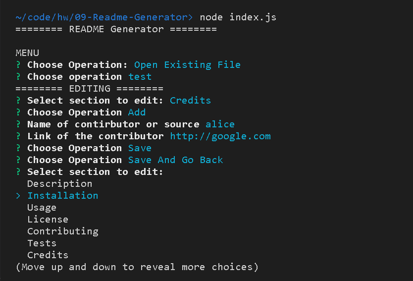

# README Generator
README Generator is a command-line application which generates READEME file based on user input.

## Installation
```bash
npm install
```

## Run
```bash
node index.js
```

## Screenshot


## Sample
[README (Sample)](./generate/test/README.md)

## Video Demo
https://drive.google.com/file/d/1YmuVlabk9YTAguhT203ZFU_NVPh7mkWK/view